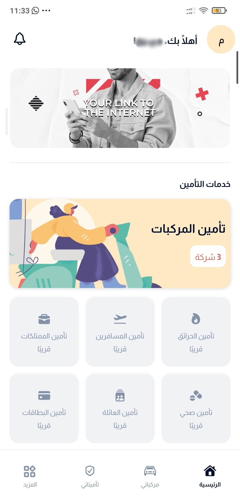
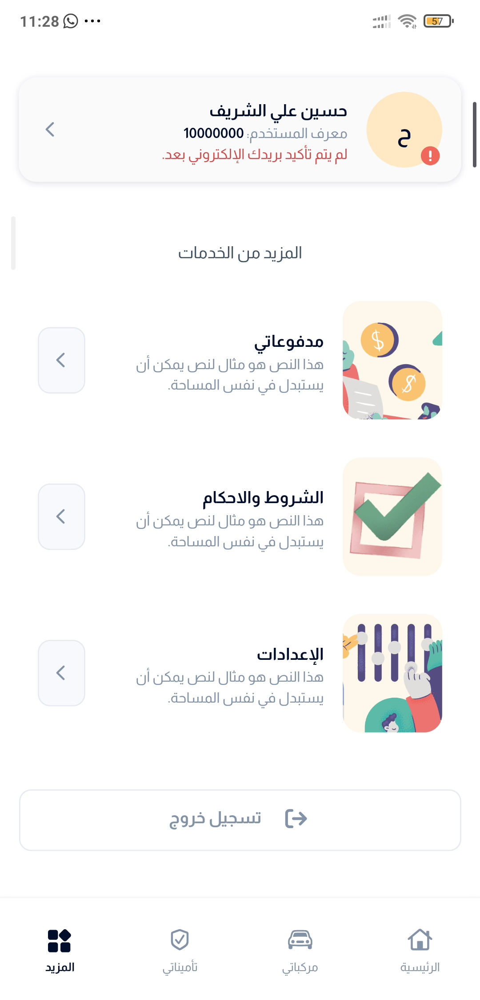
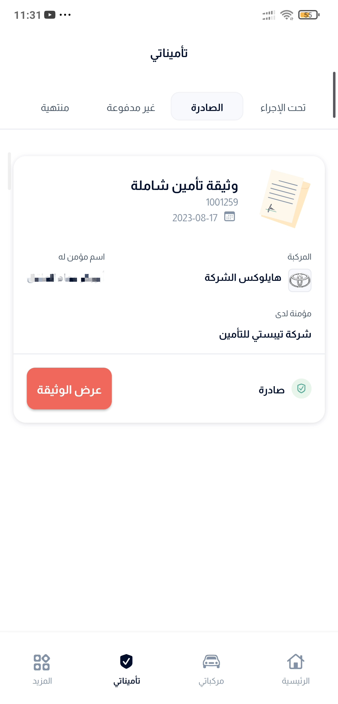
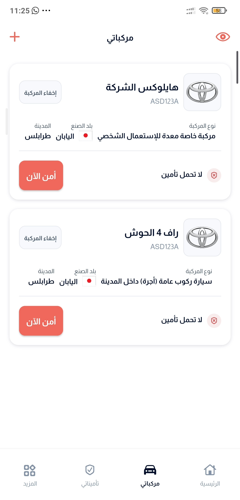
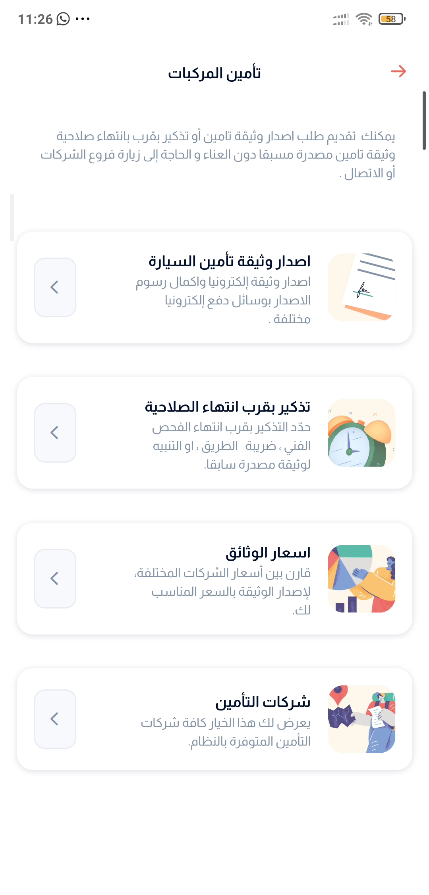

# Multi-Vendor Insurance Mobile Application

A cross-platform insurance mobile application developed with Flutter and BLoC using Clean Architecture. The application was designed to connect users with multiple insurance providers and simplify insurance discovery, vehicle management, policy access, and vehicle-insurance requests.

> This README presents the project for portfolio purposes. The screenshots show selected application interfaces and may contain anonymized or illustrative data.

## Overview

The application provides a central mobile experience for users to browse available insurance services, manage their vehicles, review issued insurance policies, and request vehicle-insurance documents or reminders. The product was designed as a multi-vendor platform rather than for a single insurance company.

The application included more than 50 screens and supported features such as QR-code generation, reminders, notifications, online payments, and user registration through passport and national-ID scanning.

## Main Features

- Multi-vendor insurance services and provider selection.
- Vehicle registration and vehicle information management.
- Viewing active and issued insurance policies.
- Vehicle-insurance requests, including document issuance and expiry reminders.
- Insurance-company comparison and selection flows.
- QR-code generation, reminders, and notifications.
- Online payment support.
- Registration and identity-data scanning using passport and national-ID documents.
- Arabic-language user interface designed for the Libyan market.

## Technology Stack

| Area               | Technologies                                                     |
| ------------------ | ---------------------------------------------------------------- |
| Mobile application | Flutter, Dart                                                    |
| State management   | BLoC                                                             |
| Architecture       | Clean Architecture                                               |
| Integrations       | REST APIs, QR-code and document-scanning flows, payment services |
| Design             | Responsive mobile UI and Arabic RTL interface                    |

## My Contribution

I contributed to the development of the mobile application using Flutter and BLoC, following Clean Architecture principles. My work included implementing application screens and user flows, integrating backend services, developing insurance-related functionality, supporting document-scanning and QR-code features, fixing defects, and improving existing features.

## Screenshots

### Home screen

  

### Additional services

  

### Issued insurance policies

  

### Vehicle management

  

### Vehicle-insurance services

  

## Project Context

This was a professional project developed during my time at Wassel in Tripoli, Libya. The application was built as part of a broader multi-vendor insurance platform and was not a personal commercial product.

## Status

The project is presented here as a selected portfolio case study. The repository may contain documentation and screenshots rather than the original production source code.
